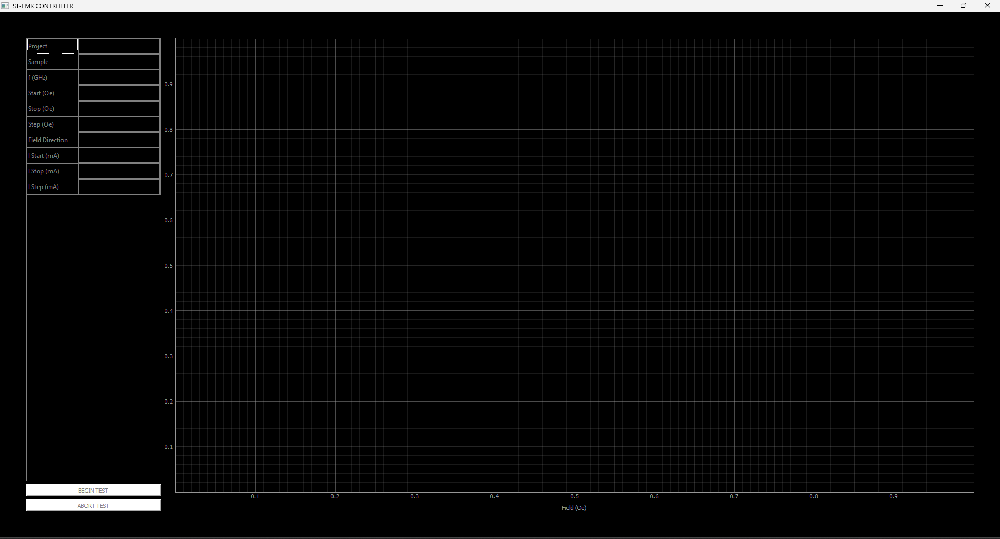

# Charles Deakins Engineering Projects

**Meliora:**  
The first photo shows my finished hardware. The second photo shows some of the design work I did to create this project.

**Fullerton Lab:**  
This photo shows a test interface I created to run tests more efficiently at UCSD and automate data processing.

**Work with Fred Harris:**  
OFDM modulator/demodulator

